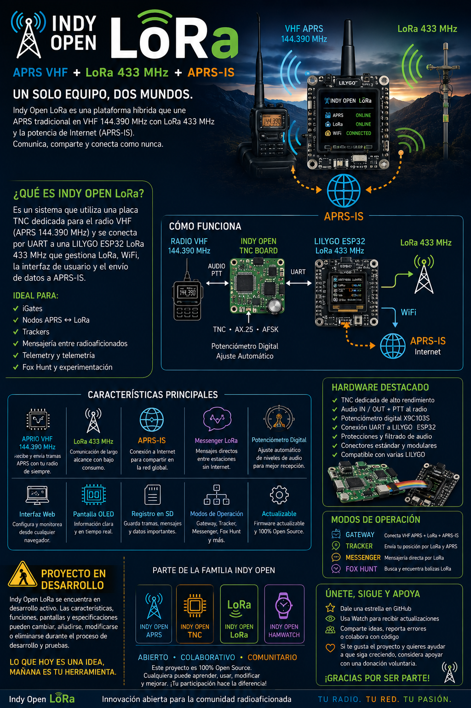

# 📡 Indy Open LoRa

### APRS VHF + LoRa 433 MHz + APRS-IS



**Indy Open LoRa** es un proyecto abierto de la familia **Indy Open** pensado para unir dos mundos de la radioafición en un mismo sistema:

- 📻 **APRS tradicional en VHF 144.390 MHz**
- 📡 **LoRa en 433 MHz**
- 🌐 **Conectividad con APRS-IS mediante Wi-Fi**

La idea es desarrollar una plataforma híbrida basada en una **TNC Indy Open** y una placa **LILYGO ESP32 LoRa**, capaz de recibir, procesar, visualizar y compartir información tanto desde APRS convencional como desde nodos LoRa.

> [!IMPORTANT]
> ## 🚧 PROYECTO EN DESARROLLO
>
> **Indy Open LoRa se encuentra actualmente en desarrollo activo.**
>
> Las características, funciones, hardware, pantallas, modos de operación y especificaciones descritas en este repositorio representan la visión actual del proyecto.
>
> ⚠️ **Las funcionalidades pueden cambiar, añadirse, modificarse o eliminarse durante el proceso de desarrollo y pruebas.**
>
> Algunas funciones mostradas en imágenes, diagramas o material promocional son conceptos previstos.

---

## 💡 La idea

Queremos crear un equipo que permita trabajar al mismo tiempo con APRS convencional y LoRa.

De forma sencilla:

```text
Radio VHF 144.390 MHz
        │
        ▼
  PCB de Indy Open TNC
        │
        ▼
 LILYGO ESP32 LoRa
     │         │
     │         └──── LoRa 433 MHz
     │
     └────────────── APRS-IS
                     por Wi-Fi
```

La TNC se encargará del mundo APRS / AX.25 en VHF, mientras que la LILYGO ESP32 gestionará LoRa 433 MHz, la conexión a Internet, la interfaz, los registros y el intercambio de información con APRS-IS.

---

## 🔧 Hardware previsto

El proyecto contempla una PCB propia que podrá integrar:

- Indy Open TNC
- Audio de entrada y salida hacia el radio
- PTT
- Conectores hacia el equipo VHF
- Potenciómetro digital para ajuste de nivel
- Conexión UART hacia la LILYGO ESP32
- Alimentación y protecciones
- Conectores modulares para facilitar pruebas y futuras versiones

La intención es que esta placa pueda utilizarse con diferentes modelos compatibles de **LILYGO ESP32 LoRa**, evitando depender de una sola versión de hardware.

---

## 📻 APRS VHF

La parte APRS utilizará un radio VHF convencional trabajando en **144.390 MHz**, conectado a la Indy Open TNC.

---

## 📡 LoRa APRS en 433 MHz

La LILYGO añadirá el enlace de radio mediante **LoRa 433 MHz**.

Esto permitirá funciones como:

- Comunicación entre nodos Indy Open
- Mensajería entre radioaficionados
- Telemetría
- Trackers
- Balizas
- Información de sensores
- RSSI y SNR
- Enlaces de experimentación de largo alcance y bajo consumo

---

## 🌐 APRS-IS

El ESP32 cuente con Wi-Fi podra conectarse a APRS-IS.

Uno de los objetivos principales es que el sistema pueda actuar como puente entre:

```text
APRS VHF
   ↕
Indy Open LoRa
   ↕
APRS-IS
```

y también:

```text
LoRa APRS 433 MHz
   ↕
Indy Open LoRa
   ↕
APRS-IS
```

---

## 🚀 Modos que queremos explorar

### 🛰️ Gateway

Equipo fijo capaz de trabajar con:

**APRS VHF + LoRa APRS 433 MHz + APRS-IS**

### 📍 Tracker

Nodo LoRa APRS capaz de enviar posición, telemetría y otros datos.

### 💬 Indy Open Messenger

Mensajería directa y de APRS entre dispositivos Indy Open mediante LoRa.

### 🦊 Fox Hunt

Experimentación con balizas LoRa, RSSI/SNR y búsqueda de transmisores.

---

## 💬 Indy Open Messenger

Queremos desarrollar un protocolo abierto de mensajería para que distintos dispositivos de la familia Indy Open puedan comunicarse.

---

## 🖥️ Firmware y Hardware

Además del hardware la PCB, desarrollaremos un firmware específico para la LILYGO ESP32.

---

## ⭐ Sigue el proyecto

Si te interesa Indy Open LoRa:

- ⭐ Dale una **Star** al repositorio
- 👀 Usa **Watch** para recibir actualizaciones
- 🍴 Haz **Fork** si quieres experimentar
- 💡 Comparte ideas y sugerencias
- 🐛 Reporta errores
- 🤝 Colabora con código, pruebas o documentación

Cada aportación ayuda a que el proyecto siga creciendo.

---

## ☕ Apoya el proyecto

Indy Open es un proyecto comunitario desarrollado por interés en la radioafición, la experimentación y el hardware/software abierto.

Si quieres ayudar a continuar desarrollando placas, probando hardware y creando nuevas funciones, podrás apoyar voluntariamente el proyecto.

❤️ **Las donaciones son completamente opcionales.**

